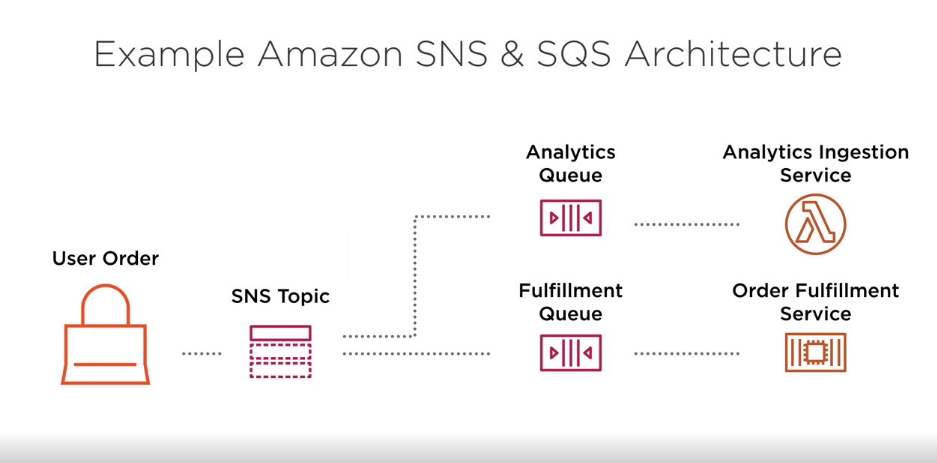

# [Understanding AWS Core Services](https://app.pluralsight.com/library/courses/understanding-aws-core-services/table-of-contents)
from pluralsignt.com for AWS Certified Cloud Practitioner Path.

## 2. Interacting with AWS

Tools for interacting with AWS services:
- AWS Console. The users can leverage their browser to configure resource.
- AWS CLI: command line access for administration AWS resources.
- AWS SDK: Programmatic access to manage AWS resources.

**AWS Management Console**: A web and app based interface for interacting with most all of 150+ AWS services. All major browsers and mobile operating systems are supported.

**AWS Command Line Interface (CLI)**: Tool to manage the use of AWS services from the command line on Windows, Mac and Linux. Most every task that can be done in the console can be done with the CLI. Managing the services from the command line.

    aws --version
    aws iam list-users

    # using containers
    docker run --rm -it amazon/aws-cli --version

    # sharing credentials
    docker run --rm -it -v ~/.aws:/root/.aws amazon/aws-cli --version

**AWS Software Developer Kit (SDK)**: Programming language-specific resources that allows the user to interact with AWS services via code. This approach enables you to automate many aspects of how you interact with the platform. Language supported
- Java .Net Node.js JavaScript PHP Python Ruby Go C++

Interacting with AWS:
- The console is a great method for testing out AWS services
- Repeated tasks can be automated using the CLI or SDK
- SDK enables automation of AWS tasks within custom applications
- Most all services and actions can be performed in any of the three

### 2.2 AWS Console
Root user log in

### 2.3 Using the AWS CLI

## 3. Compute Services
A service that enables you to leverage **cloud-based virtual machines** for workloads. This could be serving web content to visitors, running a database, or calculating statistics form a data set.

Compute services on AWS:
- **Amazon EC2**: provides secure and resizable **virtual servers** on AWS
- **AWS Elastic Beanstalk**: platform for scaling and deploying web apps and services (PaaS)
- **AWS Lambda**: enables compute without managing servers

### 3.1 Amazon EC2 Overview (IaaS)
**Amazon Elastic Compute Cloud (Amazon EC2)** is a web service that provides **resizable compute capacity** in the cloud. It is designed to make web-scale computing easier for developers.

EC2 Use cases:
- hosting a web application in the cloud. we can spin up an EC2 instance and on that instance install a web server and save our files for the web application.
- batch processing. analyzing or pre processing huge amounts of data on en EC2 instance before analyzing it.
- web service endpoint
- desktop environment instance on the cloud (windows or linux)

Core concepts of EC2:
- Instance Types
- Root Device Types
- Amazon Machine Image (AMI)
- Purchase Options

**Amazon EC2 Instance Type**
- Defines the processor, memory, and storage type that are available to any server that are launched with that instance type.
- Cannot be changed without downtime
- Types if the following categories:
    - General purpose
    - compute, memory, and storage optimized
    - accelerated computing (ml with gpu)
- Pricing is based on the instance type
- Some Instance types have unique capabilities (specialized storage, gpu)

Example of EC2 Instance Type Pricing:
- t3.medium
- m5.large
- c5d.24xlarge
- p3.16xlarge
- i3.16xlarger

**Root Device Type**
- **Instance Storage**: ephemeral storage that is physically attached to the host the virtual server is running on. If we shutdown the instance then the data will be lost.
- **Elastic Block Store** (EBS): persistent storage that exists separately from the host the virtual server is running on. The data wil be persistent during time and shutdowns. **Each EBS is attached to a single EC2 instance.**

**Amazon Machine Image (AMI)**:
- Template for an EC2 instance including configuration, operating system, and data
- AWS provides many AMI's that can be leveraged easy to spin off.
- AMI's can be shared across AWS accounts

### 3.2 Amazon EC2 Purchase Types:
Amazon EC2 purchase options when we lunching instances on AWS:
- On-Demand: you pay by the second for the instances that are launched.
- Reserved: you purchase at a discount price instances in advance for 1-3 years
- Spot: you can leverage **unused** EC2 capacity in a region for a large discount

**Reserved Instance Cost Models**:
- All upfront: entire cost for the 1 or 3 year period is paid upfront. This can be done for services we know that will be for sure running for a certain period of time.
- Partial Upfront: Part of 1 or 3 year cost is paid upfront along with a reduced monthly cost
- No Upfront: no upfront payment is made, but there will be a reduced monthly cost

**Spot Instances**:
- Can provide up to 90% discount over on-demand pricing.
- There is a market price for instance types per availability zone called **Spot price**.
- When you request instances, if you bid is higher than Spot price then the instance is assigned to the highest bidder and the workload will be launched.
- If the Spot price grows to exceed your bid, the instances will be terminated
- Spot instances can be notified 2 minutes prior to termination.

**Spot Instances are very good for workload that can start and stop.**

Amazon EC2 Purchase Options:
- If I have an instance that is **consistent** (run for at least 3 years, same requirements) and always needed, I should purchase a **Reserved Instance**
- If we have **batch** processing where the process can **start and stop** without affecting the job, i shot leverage **Spot Instances**
- If I have an **inconsistent** need for instances that cannot be stopped without effecting the job, leverage **On-Demand Instances**.

### 3.3 Launching EC2 Instances with AWS Console
EC2 > scroll down and > Launch Instance > Choose AMI (Free Tier) > **t2.micro** (Free tier Instance Type) > Next: Configure Instance Details

Set the Auto-assign Public Ip to "Enable" so we can access our instance form the internet.
To the section Advance Details we can insert commands that the server will execute when it starts. In this case is install a web server and run it

    #!/bin/bash
    yum install httpd -y
    service httpd start

then we go > Next: Add Storage > Next: Add Tags in the way to control charges > Next: Configure Security Group changing the "Source ip" access to "My Ip" (curl ifconfig.me). In this case only my ip address can SSH this EC2 instance.
I will be adding a rule for allowing http traffic on port 80 > Review and Launch

We can check the state of our instance at EC2 Dashboard. Under Public DNS we can find the link to access our instance and check if the web server is working.

To destroy an instance we go Actions > Instance State > Terminate

### 3.4 AWS Elastic Beanstalk

- Automates the process of deploying and scaling workloads on EC2 (PaaS type approach).
At high level elastic beanstalk automates the process of deploying and scaling your workloads on EC2. But the difference is instead of dealing with those servers directly, which we would call infrastructure as a service (IaaS), this is more of a platform as a service type approach (PaaS).
- supports a specific set of technologies
- Leverage existing AWS services
- Only pay for the other services you leverage. Set of services that makes easier running other AWS services. We still are running all our workload on EC2, but the process of managing the servers and handling things like provisioning and load balancing, scaling and monitoring are all handled automatically through the work of Beanstalk by connecting other services into the overall platform.

Supported Application Platforms:
- java
- .Net
- PHP
- Node.js
- Python
- Ruby
- Go
- Docker

Features and Advantages of BeanStalk vs EC2:
- integrated monitoring tools
- managed deployment for multiple servers and load balancing in production environment
- Scaling
- EC2 Customizations

Use Cases:
- Deploy an application with minimal knowledge of other services like administrating EC2 servers, scaling, metrics
- Reduce the overall maintenance needed for the application. If our workload fits in one of the use cases the Beanstalk has, we can avoid dealing with many of the administrative tasks taken care of by the platform.
- Few environment customizations are required

**Launching an App on Elastic BeanStalk**
Using the [node.js tutorial](https://docs.aws.amazon.com/elasticbeanstalk/latest/dg/tutorials.html)

AWS Console > Beanstalk
Application Name
Platform depends on the tutorial
Upload your code
Configure More Options
Create App

Actions > Terminate Application

### 3.5 AWS Lambda Overview
**AWS Lambda** lets you **run code** without provisioning or managing servers. **You pay only for the compute time you consume**. You can run code for virtually any type of application or backend service - all with zero administration.

**AWS Lambda**:
- enables the running of code **without provisioning infrastructure**
- only charged for usage based on execution time
- charge depends on amount of memory requested for the function. Configurable memory from 128 to 3008 MB
- integrates with many AWS services as S3, DynamoDb
- enables event-driven workflows ( when i have a file upload, then trigger this function)
- primary service for **serverless** architecture approach

AWS Lambda Advantages:
- reduced maintenance requirements
- enables fault tolerance without addition work
- scales based on demand ( depends on the number of users that are using the lambda function)
- pricing is based on usage ( an EC2 server can be used by 10 or 100 users but the changing will be the same for maintaining the instance, instead fro lambda you are charged based on the number usage tha we have)

## Scenario Review
Silvia
- her company is moving workload to AWS
- one workload is an app that will be leveraged for at least 5 more years
- cost efficient as possible for its EC2 usage

What EC2 purchase options should be chosen? **All Upfront Reserved**

Edward:
- deploy PHP app to a virtual server
- no experience with EC2
- will need scaling

Best Compute options: **Elastic Beanstalk**

Cindy:
- transitioning to the cloud for the data processing
- daily routines that can start and stop without problems
- will be leveraged for at least one year

what EC2 purchase options would be the most cost efficient? Spot Instances

## 4. Content and Network Delivery Service
- Amazon Route 53
- Amazon VPC
- AWS Direct Connect
- Amazon API Gateway
- Amazon CloudFront
- Elastic Load Balancing

### 4.1 Amazon Virtual Private Cloud and Direct Connect

**Amazon Virtual Private Cloud (VPC)** is a logically isolate section of the AWS Cloud where you can launch AWS resources in a virtual network that you define.
- enables virtual networks in AWS
- IP4 and IPv6
- allows for configuration of
    - ip address range
    - subnets
    - route tables
    - network gateways
- supports public & private subnets
- can utilize NAT for private subnets
- enables a connection to your data center
- can connect to other VPC's
- private connection to many AWS services

**AWS Direct Connect**: A cloud service solution that makes it easy to establish a dedicated high speed network connection from your data center to AWS.

### 4.2 Amazon Route 53 (Amazon's DNS service)

- is a Domain Name Service (DNS)
- global AWS service
- highly available
- enables global resource routing ( sending users to a specific server based on what county they are coming from.)

**DNS**: translates more readily memorized domain names to the numerical IP addresses needed for the locating and identifying computer services and devices with the underlying network protocols.

### 4.3 Elastic Load Balancer

**Elasticity**: the ability for the infrastructure supporting an application to grow and contract based on how much it is used at a point in time.

**Elastic Load Balancing**:
- distribute traffic across multiple targets
- integrates with EC2, ECS, and Lambda
- supports one or more Availability Zones in a region.
- three types of load balancers
    - Application Load Balancer (ALB)
    - Network Load Balancer (NLB)
    - Classic Load Balancer

Scaling on Amazon EC2
- **Vertical scaling**: you **"scale up"** your instance type to a larger instance type with **additional resources**. So we scale our instance type to a **larger instance** type with **additional resources**. (small to larger server)
- **Horizontal scaling**: you **scale out** and add **additional instances** to handle the demand of the application (increasing the number of servers)

### 4.3 Amazon CloudFront and API Gateway

Amazon CloudFront is a fast content delivery network (CDN) service that securely delivers data, videos, applications, and APIs to customers globally with low latency, high transfer speeds, all within a developer-friendly environment.
- it is a Content Delivery Network (CDN)
- enables users to get content from server closest to them to increase performance
- supports static and dynamic content
- utilizes AWS edge locations
- includes advanced security features
    - AWS Shield for DDoS
    - AWS WAF (wep app firewall)

**API Gateway**
- fully managed API management service ( creating APIs which are web application that other applications can call and make them available and distribute them through **CloudFront**)
- directly integrates with multiple AWS services
- provides monitoring and metrics on API calls
- supports VPC and on-premise private applications

### Scenarios
Jane
- company maintains two corporate data centers
- they want the data centers to work alongside AWS for specific workloads
- persistent connection to AWS

What service AWS would you recommend? **Direct Connect**

Tim
- serve content around the globe
- optimize performance
- CDN

Which service to optimize performance globally? **CloudFront**

Elen
- internal application on EC2
- downtime for capacity
- scaling up (vertical) or scaling out (horizontal)

Horizontal scaling (scaling out) using Elastic Load Balancing

## 5. File Storage Services
AWS File Storage and Data Transfer Services
- Amazon S3 (core services)
- Amazon S3 Glacier
- Amazon Elastic Block Store
- Amazon Elastic File System
- AWS Snowball
- AWS Snowmobile

### 5.1 Amazon Simple Storage Service S3 ( Core Service )

**Amazon Simple Storage Service (S3)**:
- stores file as objects in buckets. Buckets are unit of organization on S3. We have to create a bucket which will have a set of settings and any file that we drop in can have those settings applied to it.
- provides different storage classes for different use cases
- stores data _**automatically across multiple available zones**_, which gives us durability and resiliency for the data.
- enables URL access to files (sharing a file through a URL)
- offers configurable rules for data lifecycle
- can serve as a static website host

**Amazon S3 Non-archival Storage Classes**:
- **S3 Standard** is the default storage class and is for _**frequently**_ accessed data.
- **S3 Intelligent-Tiering** will move your data to the correct storage class based on usage.
- **S3 Standard-IA** is for _**infrequently**_ accessed data with the standard **resilience** (multiple A.Z.)
- **S3 One Zone-IA** is for **infrequently** accessed data tha is only stored in on Availability Zone.

**S3 Intelligent Tiering Storage Class**:
- Automatically moves files based on access classes
- moves between this two classes
    - frequent
    - infrequent
- same performance as S3-Standard
- cost saving if we have data to be moved between the two classes 

**S3 Lifecycle Policies**:
- Objects in a bucket can transition or expire based on the settings criteria
- transitions can enable objects to move to another storage class based on **time**. Moving based on usage is available on the **Intelligent** class.
- Expiration can delete object based on age
- Policies can also factor in **versions** of a special object in the bucket

**S3 Transfer Acceleration**: Feature that can be enabled per bucket that allows for optimized uploading of data using the AWS Edge Locations as a part of Amazon **CloudFront**. Feature for uploading data into the bucket much faster.

### 5.2 Hosting a static Website on S3
- Creating a new S3 bucket
- Uploading objects to an S3 bucket
- Accessing objects on S3 bucket from URL
- Configuring a bucket for website hosting

### 5.3 Glacier and Glacier Deep Archive:

Amazon S3 Glacier: Archiving data that will be accessed for rare circumstances.
- Designed for archiving of data within S3 as separate storage classes. ( holding payment information from customers for 1 year or three years, i will not access them only in rare cases when required)
- Offers configurable retrieval times (**quick or slow** retrieval and we will be charged based on the choice )
- can send files directly or through lifecycle rules in S3 to transition data into S3 Glacier.
- provides two different storage classes
    - S3 Glacier
    - S3 Glacier Deep Archive

**S3 Glacier vs Deep Archive**: 
- Designed for Archival data
- 90 days minimum storage duration change | 180 days (saving data for at leas 6 months)
- can be retrieved in either min or hours (different charges for every speeds) | can be retrieved in hours 
- you pay a retrieval fee per GB retrieved
- over 5 times less expensive then S3 Standard Storage Class | 23 times

The AWS Management console can be used to quickly set up Amazon S3 Glacier. Data can then be uploaded and retrieved programmatically (CLI or SDK).

### 5.4 Elastic File System (EFS)

- is a fully managed NFS (Network File System)
- designed specifically for Linux workloads
- supports up to petabyte 10^15
- data stored across multiple AZs, (data durability and resilience )
- provides two different storage classes
    - Standard
    - infrequent access
- configurable lifecycle data rules for transitioning between the two storage classes

_**The difference with the EBS is that EBS are attached to a single EC2 instance, instead EFS has the ability to be a network file system that we can attach to multiple instances at the same time**_

Amazon FSX for **Windows File Server**:
- fully managed native windows file system
- includes native windows features including 
    - SMB support
    - Active Directory integration
    - Windows NTFS
- utilizes SSD drives for low latency   

### 5.5 Data transfer with **AWS Snowball**
How to transfer large amount of data into AWS cloud without _**passing**_ through the **public internet** ?

AWS Large Scale Data Transfer Service:
- **AWS Snowball**: service to physically migrate petabyte scale data to AWS
- **AWS Snowmobile**: service to physically migrate exabyte scale data onto AWS

Large-scale Data transfer into AWS: Snowball vs Snowmobile:
- Designed for large-scale data transfers
- petabyte scale transfer || exabyte
- physical device is delivered by AWS to the our office || shipping container (huge/large)
- we upload the data on the device | AWS sets up a connection for uploading the data
- the device is returned by local carrier back to AWS
- AWS loads the data from the device to S3 

### Scenarios

Elaine:
- elearing website
- uses s3 to store the assets needed per tutorial
- hight demand during the first week
- after the first week this assets  are rarely accessed

how to reduce the S3 costs maintaining durability (multiple copies)?
Solution: S3 lifecycle rules with **S3-standard IA** storage class

Esteban:
- company moving to AWS
- have 2 PB of data to migrate
- which is the fastest approach to migrate the data (internet maybe takes too long)

Is there a fastest way to do it? Snowball

Emily:
- messaging app
- she is looking for a shared File System between 8 Linux EC2 instances
- the file system would need to support 1 PB of data

What approach is ok for Emily? EFS (NFS)

## 6. Databases Services and Utilities

AWS Databases & Related Services:
- Amazon RDS (PaaS)
- Amazon Aurora (PaaS)
- Amazon DynamoDB (SaaS)
- Amazon Redshift
- Amazon Elasticache
- AWS Database Migration Service

Different approaches:
- **IaaS** (Maximum Control over everything)
    - we would instal a Database on a EC2 instance
- **PaaS** Relation Database Service (RDS)
    - control on the database but not on the infrastructure
- **SaaS** (Minimum maintenance)
    - DynamoDB, Elasticache, Redshift

### 6.1 Amazon Relational Database Service (PaaS RDS)

It uses the **PaaS** approach for running databases that we can leverage within our applications that are running on the platform. First it is important to note that **it is a fully managed service** for relation databases.

**RDS**:
- Fully managed service for relational databases
- handles provisioning, patching, backups, and recovery of the database
- supports deployments across multiple availability zones (mylti-AZ)
- some platforms support read replicas ( helps scaling out the database)
- launches into a VPC
- provides both general purpose SSD and provisioned IOPS SSD drive options

Amazon **RDS Platforms**:
- MySQL
- PostgreSQL
- MariaDB
- Oracle Database
- SQL Server
- Amazon Aurora

**Amazon Aurora** is a MySQL and PostgreSQL-compatible relational database built for the **cloud**, that combines the performance and availability of traditional enterprise databases with the simplicity and cost-effectiveness of open source databases

**Amazon Database Migration Service (DMS)**:
- Enables you to move data into AWS from existing databases
- supports both one time and continual migration of data
- supports many popular commercial and open source databases
- only pay the compute leverage in the migration process

### 6.2 Amazon DynamoDB Overview (SaaS)
 - **fully managed NoSQL service (SaaS)**
 - provides both key-value and document database
 - enables extremely low latency at virtually any scale
 - supports automated scaling based on configuration
 - offers in-memory cache with the DynamoDB Accelerator (DAX)

 **DynamoDB** can handle more than 10^12 requests per day and can support peaks of more than 20 million requests per second.

 **DynamoDB use Cases**: 
 - scale without excessive maintenance
 - serverless applications
 - implementations where low latency is key
 - data models without BLOB storage

 ### 6.3 Amazon Elasticache & Reshift

 **Elasticache**:
 - is a fully managed in-memory data store
 - supports both **Memcached** and **Redis**
 - provides low latency in response times
 - enables scaling and replicas to meet application demand
 - handles common use cases including:
    - database layer caching
    - session storage 

**Redshift**:
- Scalable data **warehouse** service
- supports petabyte 10^15 scale warehousing of data
- leverages high performance disks and columnar storage
- offers the ability to fully encrypt the contents
- provides isolation with a VPC
- enables querying of exabytes of data in S3 using Redshift Spectrum 

### 6.4 Scenarios

Jennifer:
- transitioning the data warehouse to AWS for analysis and ML
- 2 PB
What approach would you recommend? **Redshift**

Sam:
- launch a MySQL for a new app
- direct access to the MySql server

What approach would you recommend? **EC2 + MySQL** IaaS

Frank:
- how to store real time user analytics
- low latency and scale for 10^6 players
- low maintenance work

What approach would you recommend? DynamoDB

## 7. App Integration Services

- **Amazon SNS** (simple notification service): Managed pub/sub messaging service
- **Amazon SQS** (simple queue service): Managed message queue service
- **AWS Step Function**: Serverless workflow management service

### 7.1 AWS Messaging Services

**SNS (Simple Notification Service  )**
- fully managed pub/sub messaging service
- enables you to create decoupled applications
- organized according to topics
- integrates with multiple AWS services
- provides end user notifications across SMS, email, and push notifications.
- messages are not saved, they trigger actions and after disappear

**Simple Queue Service (SQS)**
- fully managed message queue service
- enables to build decoupled and fault tolerant applications (we can have an aspect of our system going down and it can still work according to its purpose)
- supports up to 256 kb data payload
- allows messages to be stored up to 14 days
- provides two types of queues
    - standard queue
    - FIFO queue

Example of SNS & SQS Architecture:

### 7.3 AWS Step Functions
- enables orchestration of **workflows** through a fully managed service
- supports serverless architectures
- can support complex workflows including error handling
- charged per state transaction along with the other AWS services leveraged
- Workflows are defined using Amazon States Language

Example of Workflow Architecture:

AWS Step Function Integrations:
- compute services (integrate with lanbda)
- database services
- messaging services (SQS, SNS)
- data processing services
- ML services

This is a powerful tool that can be used to build out very complex work flows and have Amazon manage the state for us of the different steps within that workflow.

### 7.4 Scenarios

Ruth:
- database server went down and uses were unable to signup
- there is no guarantee for no downtime
- AWS service to prevent lost of your signups

Fault tolerant problem.
What AWS service would you recommend? SQS

Jessi:
- complex workflow

What AWS service would you recommend? Step Function

Roger:
- ecommerce platform
- platform listening for key events

SNS

## 8. Management & Governance Services

- AWS CloudTrail
- AWS CloudFormation
- AWS CloudWatch
- AWS Config
- AWS System Manager
- AWS Control Tower

### 8.1 AWS CloudTrail

With **CloudTrail**, you can log, continuously monitor, and retain **account activity** related to actions across your AWS infrastructure. CloudTrail provides event history of your **AWS account** activity, including actions taken through the AWS Management Console, AWS SDKs, command line tools, and other AWS services.

- Inserts audit trail in an **S3** bucket or into **CloudWatch Logs**
- Logs events in the regions in which they occur
- meets many compliance requirements for infrastructure auditing
- as a best practice, it should be enabled on every AWS account
- can be consolidated into an Organizational trail using AWS Organizations

AWS CloudTrail Use Cases:
- compliance requirements
- forensic analysis
- operational analysis
- troubleshooting

### 8.2 Amazon CloudWatch and AWS Config

- **CloudWatch** which provides metrics, logs, and alarms for our infrastructure
- **AWS Config** which continually evaluates infrastructure against a predefined set of rules
- **AWS Systems Manager** Provides operational data and automation across the infrastructure

**CloudWatch**:
- monitoring and management service
- collects logs, metrics, and events from most AWS services
- enables alarms based on metrics
- provides visualization capabilities for metrics
- allows for custom dashboards based on collected metrics

**AWS Config** continuously monitors and records your AWS resources configurations and allows you to automate the evaluation of recorded configurations against desired state
- provides configuration history for infrastructure
- works against rules that you can customize or even create custom validations
- includes conformance packets for compliance standards including PCI-DSS (payments)
- can work with AWS Organizations for both cross-region and cross-account

### 8.3 AWS Systems Manager

**AWS Systems Manager**  provides a unified user interface so you can view operational data from multiple AWS services and allows you to automate operational tasks across your AWS resources.
- provides multiple tools that make it easier to manage your AWS infrastructure
- enables automation tasks for common maintenance
- gives a secure way to access servers using only AWS credentials
- stores commonly used parameters securely for operational use (like password databases)

### 8.4 AWS CloudFormation
- managed service for provisioning infrastructure based on templates
- no additional charges
- templates can be YAML or JSON
- enables infrastructure as code
- manages dependencies between resource
- provides drift detection to find changes in the infrastructure

### 8.5 AWS Organizations & Control Tower

**AWS Organizations**:
- allows organizations to manage **multiple** accounts under a **single master** account
- provides organizations with the ability to leverage Consolidated Billing for **all accounts**
- enables organizations to centralize logging and security standards across accounts

AWS Organizations shows what we can do with it, but not what we should do with it. So Amazon collected a lot of the best practices for a multi account set up under a service called
**AWS Control Tower**: is a service to create a multi-account environment on AWS that follows the recommended best practices in operational efficiency, security, and governance.

**AWS Control Tower**:
- centralizes users across all AWS accounts. this allows us to minimize effort to creating users across multiple accounts.
- provides a way to create new AWS accounts based on templates ( specific settings for each different account category)
- integrated guardrails for accounts. this helps makes sure that there are specific protections for accounts underneath the master account. setting rules to accounts
- includes a dashboard to gain operation insights from a single view across all accounts.

### 8.6 Scenarios

Elliot is Ops engineer
- someone had disabled a security setting on a server
- how to track such activities

Which service would allow the organization to continually track configuration of infrastructure?
**AWS Config**

James
- launching a new app with multiple components
- minimize manual work required when creating infrastructure

What service would enable James to automate much of this effort? **CloudFormation**

Candace:
- cloud server was deleted
- follow up wit the person who deleted this instance. they wanna figure out who this individual is

Which service could show the individual that deleted this specific server? **CloudTrail**

