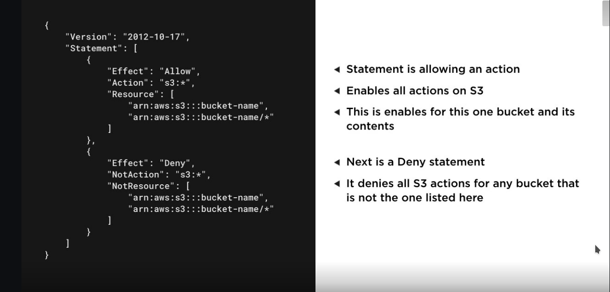
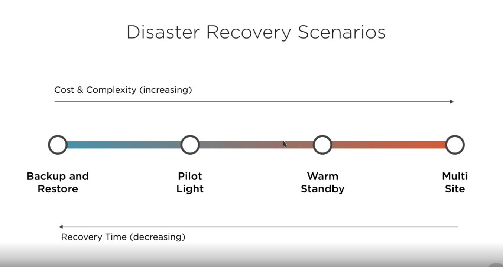
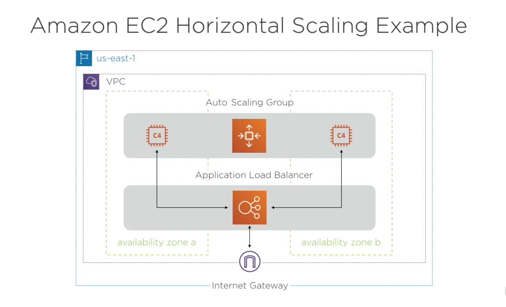
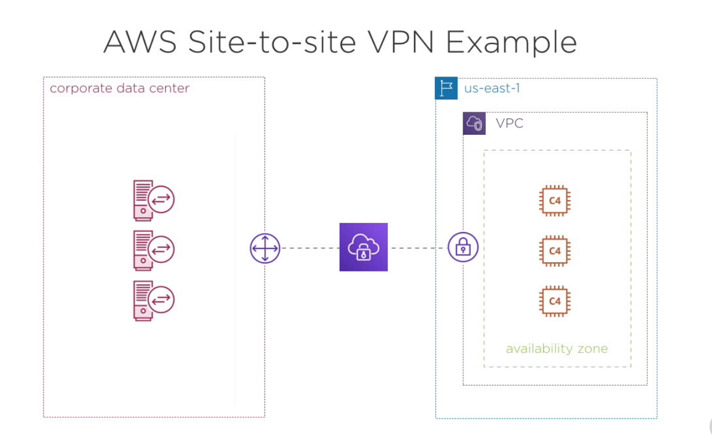

# [Introduction to Security and Architecture on AWS](   https://app.pluralsight.com/course-player?clipId=b2d82afd-e122-45fc-b203-7350fae19fdc)
# 2. AWS Core Concepts

**Acceptable Use Policy** : AWS's policy for acceptable and unacceptable uses of their cloud platform. All users must agree with this policy to have an account on the platform.
- Sending unsolicited mass email is prohibited
- hosting or distributing harmful content is prohibited
- **Penetration test are allowed for a list of specific services**

**Least Privilege Access**: when granting permission for a user to access AWS resources, we should grant them the minimum permissions needed to complete their tasks and no more. AWS recommends tha we don't use our root account as the day to day account. They recommend to create and use an **IAM** account for a daily basis use. So everyone should have access only to what they need to do the job that is given. 

### 2.3 AWS Shared Responsibility Model
**"Security and Compliance is a shared responsibility between AWS and the customer"**
- AWS Responsibility:
    - AWS is responsible for the security **of** the cloud. So AWS has responsibility for the core system that is running the entire platform.
- Customer Responsibility:
    - Customer is responsible for the security **in** the cloud. It has control on the things it is putting in the platform and how it is using it.

**AWS Responsibility**
- Access control & training for their AWS employees. They have control on what employees can access, and the training to know what they are doing. 
- Global data centers and underlying network. responsible for the connectivity to exists between the AZ and all the infrastructure.
- Hardware for the global infrastructure
- Configuration management for the infrastructure, this means responsibility for how bits of data get from one location to another. 
- Patching of cloud infrastructure and services. 

**Customer Responsibility**
- Individual access to cloud resources and user training.
- Data security and encryption (both in transit and at REST)
- Operation system, network, and firewall configuration. In case of IaaS with EC2 instances then we are responsible for the OS and all the other server configurations.
- All code deployed onto cloud infrastructure
- Patching guest operations systems and custom applications

### 2.4 [AWS Well-architected Framework](https://aws.amazon.com/architecture/well-architected/?nc1=h_ls)

AWS offers best practices to follow for creating well configured Architectures and they gathered this information on the 
**"AWS Well-architected Framework"**: The well-architected Framework is a collection of best practices across five key pillars for how to best create systems that create business value on AWS.

- **Operational Excellence**: running and monitoring systems for business value. Checking that we are being efficient with the time to build and deploy our solutions on the cloud 
- **Security**: Protecting information and business assets. Monitoring to ensure that we are following the same standards of security through the life of those assets.
- **Reliability**: Enabling infrastructure to recover from disruptions. Our system up and running as often as possible. (Reliability is the degree of consistency of a measure. A test will be reliable when it gives the same repeated result under the same conditions.)
- **Performance Efficiency**: using resources efficiently to achieve business value. Leveraging the resources on AWS and using only the amount that are needed to perform the tasks that we have for them.
- **Cost Optimization**: Achieving minimal costs for the desired value. We have to be sure we are not paying any more than we need to to achieve the level of business value that we need. ( concepts as Reserved Instances, Spot Instances, different S3 storage classes)

AWS has collected this information on a [website](https://aws.amazon.com/architecture/well-architected/?nc1=h_ls)

### 2.5 Hight-availability and Fault Tolerance 
Both of this concepts fall under the **Reliability** pillar of the Well-Architectured Framework.

**"Everything fails all the time"** CTO, Amazon
 We should build knowing that failure can happen in anytime on our architecture.

 **Reliability on AWS**: 
 - **Fault Tolerance**: being able to support the failure of components within your architecture
-  **Hight Availability**: keeping our entire solution running in the expected manner despite issues that may occur.

Building Solutions on AWS: 
- Most managed AWS services provide high-availability out of the box 
- when building solutions directly on EC2 fault tolerance must be architectured. For solutions that are **IaaS**, this is where we have to consider fault tolerance and we will have to figure out how to built into our custom solutions
- Multiple Availability zones should be leveraged so that we can deal with potential failure of a complete zone within a region.
- Some services can enable fault tolerance in our custom applications (SQS, Routo 53 to detect of there end point non available and route the users to an available server)

### 2.6 Compliance
IT Compliance is the process of meeting a third party's requirements for digital security with the aim of enabling business operations in a particular market or with a particular customer.

Common Compliance Standards:
- PCI-DSS: Compliance standard for processing credit cards
- HIPAA: Compliance standard for healthcare data
- SOC 1, 2, 3 : third-party reviews of operational processes related to the datacenters
- FedRAMP: US government data handling
- ISO 27018: handling Personally Identifiable Info

There are services on AWS that can help you know how to navigate these compliance standards

**Compliance Services**:
- AWS Config: provides conformance packs for standards
- AWS Artifact: provides self-service access to AWS compliance reports
- AWS GuardDuty: provides intelligent threat detection. detects scenarios that are happening that unusual, that could lead to you being out of compliance.

Demo:
- Examining compliance reports in **AWS Artifact**
- Exploring conformance packs in **AWS Config**

### 2.7 Scenarios

Jane:
- app for processing Credit Cards
- directly not through a third party service
- the bank needs a PCI DSS compliance report for AWS

Where should Jane go to get the information?? **AWS Artifact**

Tim:
- transitioning to the cloud
- store personal information securely in their system
- what is the company's responsibility is for security once they migrated in AWS

What is the responsibility ? 

Ellen:
- solutions architect at a startup
- building new app
- how to best leverage the best capabilities of AWS in this app

What resource should they review before planing? **AWS Well-architectured Framework**.

## 3 AWS Identities and User Management

**"Least Privilege Access"**: When granting permission access to a user on AWS resources, we should grant them the minimum permissions needed to complete their task and no more. 

### 3.1 AWS Identity & Access Management (**IAM**)
- This is the service that controls access to AWS resources. This is the service where we can create a user and configure what are their permissions.
- IAM is a free services
- Manges both authentication (verifies users) and authorization (what the user can do ) 
- Supports identity federation through **SAML** providers including Active Directory. This allows us to use an external identity provider to handle the authentication.

**IAM Identity types**
- **User**: Account for a single individual to access AWS resources. New employ > new account and assign permission to access specific resources.
- **Group**:  allows you to manage permissions for a group of IAM users. We create IAM for each user, we create group and set all the permissions for specific resources and after we add users to this group. which users will inherit the permissions of the group. 
- **Roles**: enables a user or AWS service to assume permissions for a task. Is like a sudo command for a user or when we give permissions to a service to run with root privileges on linux. Or we can consider an EC2 instance that needs to write data to an S3 bucker, but by default it can't do it, se we can assign to the EC2 instance a Role with permission to write data to S3 bucket.

How do we assign permissions? This leads to the concept of Policies which is just a Json document that defines permissions for an IAM identity.

**Policies in AWS IAM**:
- A JSON document that defines permissions for an AWS **IAM** identity ( user, group, role)
- Defines both the AWS services that the identity can access and what actions can be taken on that service.
    - EC2 server with permission for read and write to a specific S3 bucket, but not permission for deleting the bucket 
- Can be either customer managed or managed by AWS   
    - AWS managed policies are already created and can be used without the need to create custom policies, like:
        - Read access to an AWS account
        - Full access to S3

**AWS IAM Best Practices**:
- **Multi-Factor Authentication**: provides additional security with either physical or virtual device that generates a token for a login.
- **Least Privilege Access**: users should only be granted access to AWS resources that are required for their current tasks.

### 3.2 Creating an Managing IAM Users
Demo
- Creating a new IAM user
- Configuring permissions for the IAM users
- Creating an IAM Group
- Attaching permissions to an IAM Group

### 3.3 Enabling Multi-factor Authentication
Demo:
- Enabling MFA for the root user
- Enabling MFA for an IAM user

### 3.4 Amazon Cognito

**Amazon Cognito**: A managed service that enables you to handle authentication and aspects of authorization for your custom web and mobile applications through AWS 

**Amazon Cognito**:
- is a fully managed user directory service for custom applications. IAM deals with permissions for AWS resources, but what happen if we basically want to implement something similar for our custom application. Then Cognito fill that role.
- Provides UI components to be integrated for many platforms.
    - sign in
    - sign up 
- Provides security capabilities to control account access
- Enables controlled access to AWS resources (intersection with IAM). Example
    - web app that lets users upload foto, we have to be sure that users have access to a specific part of the S3 bucket that is just for them. There is a way with **Cognito** to configure access to specific pieces of AWS infrastructure that you would want a user to have access to, but **without having them to sign up for an IAM account** 
- Can work with social and enterprise identity providers. Letting users to log in with a Google account and have that correspond to a Cognito identity.

**Cognito Identity Providers**:
- Google
- Amazon 
- Facebook 
- Microsoft Active Directory
- SAML 2.0 Providers

Cognito gives us the possibility to use this level of authentication/authorization and tie it into our custom application. 

### 3.5 Scenarios
Sylvia:
- team of DevOps
- each member needs to have the same access to the cloud system

What approach would help Sylvia manage the team's permissions? Create IAM and assign to a Group

Edward:
- the EC2 servers need to access data stored within S3 buckers
- created a user in IAM for these servers and uploaded keys to the server

Is he following best practice for this approach? Use Roles for EC2 instances

William:
- migrating to the cloud
- concerns for securing access with password to AWS resources

Additional level os Security? Two factor Authentication

## 4. Data Architectures on AWS

### 4.1 Integrating On-premise Data

- **AWS Storage Gateway**: Hybrid-cloud storage service.
    - Integrates cloud storage into the local network
    - Deployed as a VM or a specif hardware  appliance to running the Storage Gateway software on it onto our network.
    - Integrates with S3 and EBS
    - Supports three different gateways types:
        - Tape gateway:
            - Tape backup virtual experience
        - Volume gateway:
            - provides cloud based iSCSi volumes to local applications for the data actually stored in the cloud
        - File gateway
            - Stores files in S3 while providing cached low-latency local access (stores files in S3 but keeping certain files on the storage gateway device so we can have low latency access, also using local **cash** pulling certain files or the one that are most recently accessed )
- **AWS DataSync**: Automated data transfer service. Setting up a system network to send data from the local data center to AWS.
    - Leverages a **DataSync** agent deployed as a VM on our network.
    - Integrates with S3, EFS, and FSx for Windows File Server on AWS 
    - Greatly improved speed of transfer due to custom AWS protocol and optimization
    - Charged for GB of data transferred 

### 4.2 Processing Data on AWS

- **AWS Glue**: Manged Extract, Transform, and Load **ETL** Service. ETL means that we have data stored somewhere, we need to pull it out from where it is stored (Extract), then we have to transform so will have to do things like normalizing the data. Then we have the Load step, this means that we have to put the data in a different location where it will be analyzed. And this is the ELT process.
- **Amazon EMR**: Elastic Map Reduce is a big data cloud processing service
- **AWS Data Pipeline**: data workflow orchestration service across AWS services. This a service for managing how the data get from point A to point B, especially if it needs to go through a specific type of AWS service in the middle, this is where **Data Pipeline** can be very helpful.

**AWS Glue**:
- fully managed ETL (extract, transform and load) service on AWS 
- supports data in Amazon RDS, DynamoDB, Redshift, and S3
- supports a serverless model of execution ( we just use the service which handles everything)

**Amazon EMR (Elastic Map Reduce)**:
- Enables big-data processing on Amazon EC2 and S3
- Supports open-source frameworks and tools
    - Apache Spark, Flink, Hive, Hudi, HBase, Presto
- operates in a **cluster** environment without additional configuration

**AWS Data Pipeline**:
- managed ETL service on AWS
- manages data workflow through AWS services
- supports S3, EMR, Redshift, DynamoDB, and RDS
- can integrate on-premise data stores within our data pipelines.

### 4.3 Analyzing Data

**Data Analysis Services**:
- Amazon Athena: Service that enables querying of data stored in Amazon S3
- Amazon Quicksignt: Business intelligence service enabling data dashboards
- Amazon CloudSearch: managed search service for custom applications

**Amazon Athena**:d
-  Fully managed serverless service ( we don't have to configure any of the underlying infrastructure, we have just lo leverage the service )
- enables querying of large-scale data stored in Amazon S3 (Data lakes approach)
- queries are written in SQL
- charged based on the data scanned for the query

**Amazon Quicksignt**:
- fully managed business intelligence service
- enables dynamic data dashboards based on data stored in AWS
- charged on a per-user and per-session pricing model
- multiple versions provided based on needs

**Amazon CloudSearch**
- fully-managed search service on AWS
- support scaling of search infrastructure to meet demand
- charged per hour and instance type of search infrastructure
- enables developers to integrate search into custom applications

### 4.4 Integrating AI and Machine Learning

- **Amazon Rekognition**: Computer vision service powered by ML. We can get insights out of images that we have stored on the platform.
    - Fully managed image and video recognition depp learning service 
    - identifies objects in images
    - identifies objects and actions in videos
    - can detect specific people using facial analysis
    - supports custom labels for our business objects
- **Amazon Translate**: text translation service powered by ML
    - fully managed service for translation of tex
    - currently supports 54 languages
    - can perform language identification
    - works both in batch and real-time
- **Amazon Transcribe**: speech to text solution using ML
    - fully manages speech recognition service
    - recorded speech is converted into text in custom applications
    - includes a specific sub-service for medical use ( medical terms )
    - batch and real time transcription
    - 31 languages supported

### Scenarios:

Ruth:
- process large scale data set needs to be processed before analysis
- just want to define the processing

What service would be useful for her??? **AWS Glue**

Jessi:
- working to identify an approach for controlled lab access with facial recognition

Is there an AWS service that can help with this approach? **Amazon Rekognition**

Roger:
- ways to visualize the data sales
- is currently stored in Redshift(data warehouse)

What AWS service would allow this access to the data by non-technical resources? **Amazon Quicksignt**

### 5. Disaster Recovery:

**Disaster recovery**(DR) is about preparing for and recovering from a disaster. Aby event that has a negative impact on a company's business continuity or finances could be termed a disaster.This includes hardware or software failure, a network outage, a power outage, physical damage to a building like fire of flooding, human error, or some other significant event.

### 5.1 Disaster Recovery Architecture:

**Disaster Recovery Scenarios** listed in increasing Cost&Complexity and decreasing Recovery Time
- Backup and Restore
- Pilot Light
- Warm Standby
- Multi Site

**Backup and Restore**:
- Production data is backed up into Amazon S3
- Data can be stored in either standard or archival storage classes
- EBS data can be stored as snapshots in Amazon S3 also
- In a Disaster Recovery event. a process is started to launch new environment instances 
- This approach has the longest recovery time (the time needed for being up and running another time), and has the least cost.

**Pilot Light**:
- Key infrastructure components are kept running in the cloud
- Designed to reduce the recovery time over the Backup&Restore approach
- Does incur cost of this infrastructure continually running in the cloud.
- AMIs are prepared for additional systems and can be launched quickly.

The **pilot light** method gives you a quicker recovery time then the backup-&-restore method because the **core pieces** of the system are already running and are continually kept up to date. 

**Warm Standby**: 
- A scaled-down version of the full environment is running in the cloud
- Critical systems can be running on less capable instance types
- Instance types and other systems can be up for disaster recovery event
- Does incur cost of this infrastructure continually running in the cloud

**Multi Site** (on-premise + cloud infrastructure up and running,or running in more then one region):
- full environment is running in the cloud
- utilizes instances types needed for the production not just recovery
- provides a near seamless recovery process
- incurs the most cost over the other approaches

### 5.2 Selecting a Disaster Recovery Architecture for an Organization
Values that we have to take in consideration for the decision
- **Recovery Time Objective (RTO)**
- **Recovery Point Objective (RPO)**

**Recovery Time Objective (RTO)**: the time it takes to get your system back up and running to the ideal business state after a disaster recovery event.

**Recovery Point Objective (RPO)**: the amount of data loss (in terms of time) for a production system during a disaster recovery event. Loosing data of 1 hour, after it i have to be up and running.

### Scenario:

Roger:
- several workload on AWS
- architecting the disaster recovering approach
- wants a **seamless** transition during an event

Multi Site approach

Jennifer:
- they don't have an approach
- they need to minimize cost is  more critical than minimizing RTO 

Backup&Restore

Eliza:
- they keep **few key servers** up and running in AWS in case of an event
- these servers have smaller instance types what production would need

Which disaster approach most closely matches this scenario? Pilot Light

## 6. Architecting Application on EC2

Scaling on AWS:
- **Vertical scaling**: "scaling up" our instance type to a larger instance type with additional resources
- **Horizontal scaling**: "scaling out" add additional instances to handle the demand of our application 

In the cloud Horizontal scaling is more sustainable approach than vertical scaling. In the vertical scaling we will need to to restart out instance for creating a new one with more resources. In horizontal scaling we create new copies of our original instance.

**Amazon EC2 Horizontal Scaling Service**
- **Auto Scaling Group**: set of EC2 instances with rules for scaling & management
- **Elastic Load Balancer**: distributes traffic across multiple targets

**Amazon EC2 Auto Scaling Group**
This is like one of the deployment types of kubernetes (StatefullSet, Deployment, )
- Launch template defines the instance configuration for the group (deployment yaml file)
- defines the minimum, maximum, and desired number of instances
- performs health checks on each instance
- exist within 1 ore more availability zones in a single region. We span it in multiple available zones because this adds a level of fault tolerance in case of an AZ going down. 
- works with "on-demand" and "spot" instances

**EC2 Horizontal scaling example**:
- First we have a region, and in this case this will be **"us-east-1"** 
- inside of our region we have configured a **VPC** with an **Internet gateway**. This VPC will house our custom application. 
- we have supported that across two different **Availability Zones** A and B 
- we created our **auto scaling group**, and it exists within both availability zones, and we chose to have a desire **capacity of two**. So it's going to try to keep it balanced between the different availability zones. **So it will launch one instance in Availability Zone A and one instance in Availability Zone B**.

- Now we wanna have users be able to be routed to a server, the server that has the most room to handle their request, and so we're going to have a specific type of **ELB** called an application load balancer. That's going to be between our users and the specific servers that they're going to be accessing. Now it knows how to work effectively with the **Auto scaling group**, so it knows what instances are healthy and which ones are not. So in the beginning, all of these instances air healthy, so the **application load balancer** can route the user traffic to either of the servers. 
- However, let's say that something changes and the server that we have an availability zone A is no longer healthy. Well, the auto scaling group will note that it will let the application load balance or know that, and it will stop sending traffic to that particular server while the auto scaling group terminates that server and then goes in and actually starts a new server. Once that startup process is complete, it can communicate with the application load balancer and let it know that it is now safe to send traffic back to availability Zone A.

**AWS Secrets Manager**: 
- we need a way when scaling out to multiple servers to securely integrate things like credentials, API keys, tokens, and other secret content in a way that cant be compromised. Example are the credentials for the database, we can't store them in our public repositories.
- Secrets Manager Integrates natively with RDS, DocumentDB, and Redshift
- can auto-rotate credentials with integrated services
- enables fine-grained access control to secrets, this means that we know exactly which servers adn what applications have access to which secret values that are stored within the **Secrets Manager**

### 6.2 Controlling Access to EC2 Instances
- **Security Groups**: enables firewall-like controls for resources within the VPC
- **Network ACLs**: controls inbound and outbound traffic for subnets within the VPC
- **AWS VPN**: secure access to an entire VPC using an encrypted tunnel

**Security Groups**:
- Serve as firewall for our EC2 instances
- Control inbound and outbound traffic
- this work at the instance level, associating an EC2 group with a specific instance
- EC2 instances can belong to multiple security groups
- VPCs have a default security group
- must be explicitly associated with an EC2 instance
- ** by default all outbound traffic is allowed**, our server can send any information out to the internet.

What are **Access Control Lists**?
ACLs are a network filter utilized by routers and some switches to permit and restrict data flows into and out of network interfaces. When an ACL is configured on an interface, the network device analyzes data passing through the interface, compares it to the criteria described in the ACL, and either permits the data to flow or prohibits it.

**Network ACL**:
 - works at the subnet level within an VPC, when we define a network configuration, every server that get spun up within a sub net will adopt the ACL for that subnet
 - enables us to allow and deny traffic
 - **each VPC has a default ACL that allows all inbound and outbound traffic**
 - by default a new created custom ACLs denies all traffic until rules are added

 **AWS VPN**
 - creates an encrypted tunnel into our VPC. If we don't want our VPC to be accessed by the internet but we still want to have a way to get access to manage the servers tha are withing that VPC 
 - can be used to connect our data center or even individual client machines to our VPC
 - supports two services:
    - Site-to-site VPN
    - Client VPN

**AWS Site-to-site VPN Example**:
- So let's say that we have our own corporate data center and we have several servers 
- need to interact with some EC2 instances that we have "spun up" within our VPC on AWS. 
- we could utilize the AWS VPN service. We would create a customer gateway, and we would need to enter that information into the service. And then we would have a VPN gateway that would exist within our VPC on AWS. And once these things are in place and once they know how to communicate with one another, we then would be able to have encrypted traffic traveling back and forth between our corporate data center and eight of us. 

Now you may be asking, How is this different from **AWS Direct connect**? And that's a great question. With AWS Direct connect, you have a direct connection to the **AWS global infrastructure** that doesn't have to go over the **public Internet**. However, when you're using AWS VPN, that traffic does go over the Internet, it is just encrypted the entire way.

### 6.3 Protecting Infrastructure from Attacks

Security Services:
- **AWS Shield**: managed DDoS protection service for apps on AWS
- **Amazon Macie**: data protection service powered by machine learning
- **Amazon Inspector**: automated security assessment service for EC2 instances

**"Distributed Denial of Service (DDoS)"** is a type of attach where a server or group of servers are flooded with more traffic that they can handle in a coordinated effort to bring the system down.

**AWS Shield**:
- provides protection against DDoS attacks for apps running on AWS
- enables on-going threat detection and mitigation
- has tow different service levels:
    - standard
    - advanced

**Amazon Macie**:
- utilizes machine learning to analyze data stored in Amazon S3
- it can detect personal information and intellectual property on S3
- provides a dashboard that show how the data is being stored and accessed
- enables alerts if it detects anything unusual about data access. if will search for anomaly detection on how our data is accessed.

**Amazon Inspector**:
- enables scanning of Amazon EC2 instances for security vulnerabilities. if we wanna be sure that our EC2 instance is ready and save for the internet then we use the Inspector to check for possible vulnerabilities in our configuration
- charged by instance per assessment run
- tow types of rules packages:
    - **Network Reachability Assessment**. what is available to the internet from to our servers
    - **Host Assessment** checks the state of configuration

### 6.4 Deploying Pre-defined Solutions

Deploying Pre-defined Solutions on AWS:
- **AWS Service Catalog**: managed catalog of IT services on AWS for an organization
    -  targeted to serve as an organizational service catalog for the cloud.
    - can include single server image to multi-tier custom applications. can handle a wide variety of infrastructures needs on AWS
    - enables organizations to leverage services that meet compliance. 
    - supports a lifecycle for services released in the catalog
- **AWS Marketplace**: catalog of software to run on AWS from third-party providers
    - curated catalog of third-party solutions for customers to run AWS
    - provides AMIs, CloudFromation stacks, and SaaS based solutions
    - enables different pricing options to overcome licensing in the cloud
    - charges appear on AWS bill

### 6.5 Developer Tools

AWS Developer Services:
- **AWS CodeCommit**: manage source code repository deeply integrated with AWS
- **AWS CodeBuild**: this is a build service or a CI/CD
- **AWS CodeDeploy**: service that takes care of the deployment to different AWS services
- **AWS CodePipeline**: this service knows how to work with all of the service previously mentioned to create to create a pipeline so we can go through and look at the entire process of building testing and ultimately deploying our applications.
- **AWS CodeStar**: which gives a great way bootstrap this entire process for our custom application.

**AWS CodeCommit**:
- is a manages source control service on AWS
- utilizes git for repositories
- control access with IAM policies
- serve as an alternative to Github and Bitbucket
 

**AWS CodeBuild**:
- fully managed build and continuous integration service on AWS CI/CD 
- don't have to worry about maintaining infrastructure
- charged per minute for compute resources we utilize 
- takes care of building the application and creating the output artifacts

**AWS CodeDeploy**:
- managed deployment service for deploying our custom applications
- deploys to EC2, Fargate(container service), Lambda, and on-premise servers
- provides a dashboard for deployments in the AWS Console

**AWS CodePipeline**: 
- creates a fully managed continuous delivery service on AWS. knows how to integrate with the previous services that we mentioned above
- provides capabilities to automate building, testing, and deploying
- integrates with other developer tools as well as Github

**AWS CodeStar**: this in not like a different service, but it is like a tool to make easier the use of the other services.
- Workflow tool that automates the use of the other developer services
- Can create a complete continuos delivery toolchain for a custom application 
- Provides custom dashboards and configurations int the AWS Console
- We are charged only for the other services you leverage

### Scenarios:

Ellen: 
- made a transition to AWS
- they want to be sure each department is following best practice
- they want to create compliant IT services that other departments can use

What service would you recommend? AWS Service Catalog, services for use in the organization. Instead MarketPlace would be for third party services that can be launch in AWS

Tim: 
- AWS for multiple workloads
- they had downtime due to one of their application failing on EC2
- Tim has to avoid downtime if an instance stop responding

What approach would you recommend to Tim? Horizontal Scaling this means EC2 auto scaling Group alongside an Elastic Load Balancer 

Jane:
- sensitive information from the users
- reasonable policies in place for data stored in S3
- Jane is worried if some of those policies accidentally get changed could lead to a potential data breach
- she is worried of a breach going unnoticed

Macie in the way to use ML to classify the data, find the sensitive ones and monitor that data and its access patterns and can proactively alert them if it sees any anomaly happening within any of these patterns

## Exam Part

